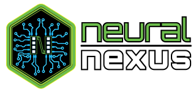

<div align="center">
  <p align="center">
    
  </p>
  <p align="center">
    <strong>The professional-grade, framework-agnostic long-term memory protocol for AI agents.</strong>
  </p>
  <p align="center">
    <a href="#-core-features">Features</a> •
    <a href="#-quick-start">Quickstart</a> •
    <a href="docs/">Documentation</a> •
    <a href="#-the-ecosystem">Ecosystem</a> •
    <a href="#-architecture">Architecture</a>
  </p>
</div>

---

# 🧠 Neural Nexus: AI Memory

**Neural Nexus** is a centralized "brain" for your AI agents. It provides a standardized, high-performance interface for storing, retrieving, and maintaining facts, preferences, and decisions over time. 

By decoupling memory from specific LLMs or frameworks (like LangChain or OpenClaw), Neural Nexus ensures your agents share a consistent, long-term context across every platform—API, CLI, Browser, and Mobile (all via native MCP or the OpenAI-compatible proxy).

## ✨ Core Features

### 🔍 Hybrid RRF Retrieval
Nexus uses **Reciprocal Rank Fusion (RRF)** to merge semantic vector similarity with traditional keyword precision. This ensures that whether you're searching for a vague concept or a specific serial number, you get the right result every time.

### 📉 Temporal Decay Engine
Memories aren't static. Our decay engine calculates relevance based on recency and strength. Unreinforced memories naturally fade, while frequently accessed information stays at the forefront of your agent's context.

### 🛡️ Semantic Deduplication (Zero-Bloat)
Stop "fact bloat" before it starts. When storing new information, Nexus checks for existing matches. If a new memory is **>= 0.95 similar** to an existing one, the records are **merged and reinforced** rather than duplicated.

### 🔐 Granular Security (JWT)
Secure your agent's brain with a robust, token-based permission system. Create scoped API keys (e.g., `memory:read` only) for different agents or users, ensuring strict data isolation and preventing unauthorized modifications.

### 🔒 Privacy-First & Local-First
Uses `@xenova/transformers` for **local embedding generation**. Your sensitive data doesn't need to leave your infrastructure for vectorization.

### 🚀 One-Command Start
Get a production-ready memory environment running in seconds with our automated `nexus` system.

---

## ⚡ Quick Start

### 1. Prerequisites
- **Node.js** (v18+) — [Download for Windows/Mac/Linux](https://nodejs.org/en/download)
- **Qdrant** — required as the vector database. The nexus downloads and starts it for you automatically — no separate install needed.

### 2. Launch in 60 Seconds

**A. Clone the repo...**

```git
git clone https://github.com/ArtisticMusician/NeuralNexus_universal.git
```

**B. and run the automation script:**

**Linux / macOS:**
```bash
./nexus.sh
```

**Windows:**
```batch
nexus.bat
```

This will initialize your environment, check dependencies, and start the Core Server and OpenAI Proxy.

**Default Ports:**

- API Server: `http://localhost:3000`
- OpenAI-Compatible Proxy: `http://localhost:3001`
- Dashboard: `http://localhost:6969`
- Qdrant: `http://localhost:5304`

---

### 3. Connect Your AI to Neural Nexus

Once the server is running, pick the connection method that matches your setup:

#### Option A — OpenAI-Compatible Proxy (recommended for most setups)

Any app that supports an OpenAI base URL works out of the box — ChatGPT-compatible UIs, LangChain, LlamaIndex, n8n, etc.

Point your app at the proxy instead of OpenAI:

```text
Base URL:  http://localhost:3001/v1
API Key:   your NEXUS_PASSWORD from .env (or any string if auth is disabled)
```

The proxy automatically injects relevant memories into every request and captures new information from responses. No code changes needed on the AI side.

**Works with:** OpenAI, Ollama, LM Studio, LocalAI, Groq, and anything OpenAI-compatible.

**Ollama** — point Neural Nexus at your local Ollama server:

```env
LLM_TARGET_URL=http://localhost:11434/v1
LLM_MODEL=llama3.2
```

Then connect your client to the Neural Nexus proxy instead of Ollama directly:

```text
Base URL:  http://localhost:3001/v1
API Key:   your NEXUS_PASSWORD from .env (or any string if auth is disabled)
```

**LM Studio** — start the local OpenAI-compatible server in LM Studio, then point Neural Nexus at it:

```env
LLM_TARGET_URL=http://localhost:1234/v1
LLM_MODEL=your-loaded-model-id
```

Then connect your client to the Neural Nexus proxy:

```text
Base URL:  http://localhost:3001/v1
API Key:   your NEXUS_PASSWORD from .env (or any string if auth is disabled)
```

---

#### Option B — MCP Server (Claude Desktop, Cursor, VS Code, Gemini CLI, ChatGPT, OpenClaw)

MCP gives your AI agent direct access to `recall_memory` and `store_memory` as callable tools.

**Claude Desktop** — add to `claude_desktop_config.json`:

```json
{
  "mcpServers": {
    "neural-nexus": {
      "command": "node",
      "args": ["/ABSOLUTE/PATH/TO/NeuralNexus/dist/src/mcp.js"]
    }
  }
}
```

**Cursor / VS Code** — open MCP settings and add a server with the same `command` and `args` as above.

**Gemini CLI** — to add Neural Nexus globally for all projects, use your user-level Gemini config:

```bash
gemini mcp add neural-nexus node \
  /ABSOLUTE/PATH/TO/NeuralNexus/dist/src/mcp.js \
  -e NEXUS_MCP_TOKEN=nn_your_token_here \
  --scope user
```

This writes the server config to `~/.gemini/settings.json`, making it available in every Gemini CLI session on your machine.

You can also add it manually to `~/.gemini/settings.json`:

```json
{
  "mcpServers": {
    "neural-nexus": {
      "command": "node",
      "args": ["/ABSOLUTE/PATH/TO/NeuralNexus/dist/src/mcp.js"],
      "cwd": "/ABSOLUTE/PATH/TO/NeuralNexus",
      "env": {
        "NEXUS_MCP_TOKEN": "nn_your_token_here"
      },
      "trust": true,
      "timeout": 30000
    }
  }
}
```

The MCP server reads auth from `NEXUS_MCP_TOKEN`. Tokens beginning with `nn_` are treated as API keys; other values are treated as JWTs.

**ChatGPT** — ChatGPT does not currently connect to a local MCP server directly. To use Neural Nexus with ChatGPT, deploy the MCP server to a remote HTTPS endpoint, then add it as a custom MCP connector in ChatGPT developer mode.

High-level flow:

1. Deploy your Neural Nexus MCP server somewhere ChatGPT can reach over HTTPS.
2. In ChatGPT, enable developer mode for your workspace.
3. Create a new custom MCP connector and enter your remote endpoint and auth settings.
4. Test the connector in ChatGPT before publishing it to your workspace.

> ChatGPT custom MCP connectors are currently limited by plan and product support. At the time of writing, OpenAI documents full MCP support as rolling out in beta for ChatGPT Business and Enterprise/Edu, and notes that local MCP servers are not currently supported.

**OpenClaw** — add to your agent's `mcpServers` config in the same format.

> Use the absolute path to `dist/src/mcp.js`. Run `npm run build` first if `dist/` doesn't exist yet.

---

#### Option C — Direct REST API

Call the API directly from your own code or agent.

**Store a memory:**

```bash
curl -X POST http://localhost:3000/store \
  -H "Content-Type: application/json" \
  -H "X-API-Key: your-api-key" \
  -d '{ "text": "User prefers dark mode", "category": "preference" }'
```

**Recall memories:**

```bash
curl -X POST http://localhost:3000/recall \
  -H "Content-Type: application/json" \
  -H "X-API-Key: your-api-key" \
  -d '{ "query": "what does the user prefer?", "limit": 5 }'
```

See the full [API Reference](docs/api.md) for all endpoints.

---

### 🔧 Troubleshooting

**Qdrant Setup Issues:**
- If `nexus.bat` hangs during Qdrant installation, run `scripts\reset-qdrant.ps1` to clean up and try again
- Check that port 5304 is not blocked by firewall or another Qdrant instance
- Ensure you have internet connection for the initial Qdrant download

**Manual Qdrant Reset:**
```powershell
# In PowerShell, from project root:
.\scripts\reset-qdrant.ps1
```

**Common Issues:**
- **"Qdrant health check timed out"**: Check the separate Qdrant terminal window for errors
- **"Download failed"**: Verify internet connection and try the reset script
- **Port conflicts**: Stop any existing Qdrant processes before running nexus

---

## 🔌 The Ecosystem

Neural Nexus isn't just a server; it's a complete memory ecosystem.

| Interface | Description |
| :--- | :--- |
| **OpenAI Proxy** | A transparent proxy that injects memories into chat contexts and intercepts tool calls in real-time streams. |
| **MCP Server** | Native **Model Context Protocol** support for immediate integration with Claude Desktop and other MCP clients. |
| **Mobile Bot** | A Telegraf-based **Telegram Bot** for capturing and recalling memories on the go. |
| **Browser Ext** | A Manifest V3 extension with "Read-to-Remember" context menu support. |
| **Web Dashboard** | A Vite + React dashboard for visual browsing and management of your agent's brain. |
| **CLI Manager** | A powerful CLI tool (`nexus`) for bulk operations, imports, and exports. |

---

## 📚 Documentation

Our [**Documentation Hub**](docs/) contains exhaustive guides for every aspect of the system:

- 🛠️ [**Setup Guide**](docs/setup.md): Detailed installation and environment configuration.
- 📡 [**API Reference**](docs/api.md): Full documentation of all REST endpoints.
- 🤖 [**Integrations**](docs/integrations.md): How to connect to OpenAI, Claude, LangChain, and more.
- 📜 [**NNMP Protocol**](docs/protocol.md): The formal specification of the Neural Nexus Memory Protocol.
- 🔍 [**Technical Audit**](docs/technical_audit.md): Deep dive into the search math and engine logic.

---

## 🏗️ Architecture

Neural Nexus follows a strict hub-and-spoke design centered around the `NeuralNexusCore`.

1. **Adapters**: The entry points (Proxy, MCP, Bot).
2. **NeuralNexusCore**: The orchestrator handling atomicity, deduplication, and budgeting.
3. **Specialized Services**:
   - **StorageService**: High-fidelity Qdrant wrapper.
   - **EmbeddingService**: Local Transformers.js model management.
   - **CategoryService**: Heuristic-based intent detection.
   - **DecayEngine**: Mathematical relevance scoring.

---

## ⚖️ License

**Neural Nexus License (Personal & Non-Commercial)**
Free for personal use, education, and internal prototyping. Commercial use or redistribution as a service is prohibited without written consent. See `LICENSE.md` for full terms.

